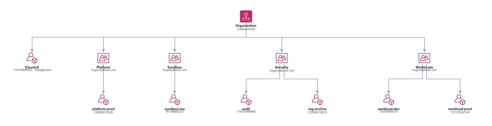

# Architect View — Architecture Overview

> **Demo Report** — AWS account IDs and resource identifiers in this report have been
> replaced with synthetic equivalents for public safety. Architecture, workloads,
> findings, and relationships are based on a real AWS environment.

---

> _Part of the [Architect View](./README.md) · Audience: Solutions / Cloud Architects · Confidence: Likely_

## Architecture Overview

The environment is a multi-account AWS estate centred on **eu-central-1**, running a serverless API pattern backed by DynamoDB, with at least four distinct workloads across three accounts and a clear prod/dev/sandbox separation. The dominant design signal is internet-facing API Gateway endpoints fronting per-environment data stores — a shape that carries both dependency and blast-radius implications worth examining before any modernisation work.

> **Confidence: Likely** — derived from graph evidence; some relationships and classifications rely on inference rather than explicit tagging (see Unknowns).

### Architectural Shape

The estate spans **7 accounts** and contains **807 resources**. The primary compute pattern visible in the evidence is serverless: two public API Gateway endpoints are present in **eu-central-1**:

| Endpoint | Account |
|---|---|
| `https://gfwaiva01f.execute-api.eu-central-1.amazonaws.com` | 105769365151 (Dev) |
| `https://xdmn5ldmif.execute-api.eu-central-1.amazonaws.com` | 122122642149 (Prod) |

Both endpoints are reachable from `internet`, making them externally exposed surfaces. Each is associated with a DynamoDB table in the same account and region:

| DynamoDB Table | Account | Environment |
|---|---|---|
| `cloudox-demo-atlas-dev-items` (`arn:aws:dynamodb:eu-central-1:105769365151:table/cloudox-demo-atlas-dev-items`) | 105769365151 | Dev |
| `cloudox-demo-atlas-prod-items` (`arn:aws:dynamodb:eu-central-1:122122642149:table/cloudox-demo-atlas-prod-items`) | 122122642149 | Prod |
| `cloudox-demo-sandbox-scratch` (`arn:aws:dynamodb:eu-central-1:161388682021:table/cloudox-demo-sandbox-scratch`) | 161388682021 | Sandbox |

Internet Gateways are present in both **eu-central-1** and **us-east-1** across multiple accounts (`igw-0d14f1dd4e54d5906` in eu-central-1/110019496666; `igw-00ed21b9a0e6596a8`, `igw-0567575921f471548`, `igw-0cff0d66b4fd90803` in us-east-1 across accounts 110019496666, 105769365151, and 122980216815). This indicates VPC infrastructure exists beyond the serverless workloads, though the workloads associated with those gateways are not covered in this section.

### Environments & Accounts

Three functional environments are identifiable from naming and account separation:

| Environment | Account ID | Key Workloads |
|---|---|---|
| **Production** | 122122642149 | Cloudox Demo Atlas Prod API (`cloudox-demo-atlas-prod-api`), Cloudox (`cloudox`) |
| **Development** | 105769365151 | Cloudox Demo Atlas Dev (`cloudox-demo-atlas-dev`), Cloudox Demo Atlas Dev API (`cloudox-demo-atlas-dev-api`) |
| **Sandbox** | 161388682021 | Cloudox Demo Sandbox Scratch (`cloudox-demo-sandbox-scratch`) |

Account-level isolation between prod and dev is a positive structural choice — it limits the blast radius of a misconfiguration or credential compromise in dev from reaching prod data. The sandbox account (`161388682021`) appears to hold exploratory or transient workloads; **Cloudox Demo Sandbox Scratch** is classified as *Assumed* confidence, meaning its purpose and lifecycle are inferred rather than confirmed.

One workload — **Cloudox** (`cloudox`, account 122122642149, eu-central-1) — is classified at *Verified* confidence and sits in the production account alongside the Atlas Prod API. Its relationship to the API workload is not resolved in this section.

A system-level entity **Cloudox Demo Atlas Dev** also appears without an account binding, suggesting a cross-account or logical grouping construct whose membership is not fully resolved.

### Key Patterns

**Serverless API + DynamoDB per environment** is the clearest repeating pattern. Dev and prod mirror each other structurally (API Gateway → DynamoDB), which is good for parity but means any architectural debt in the pattern is replicated across environments.

**Internet exposure is the primary ingress path.** Both API Gateway endpoints are internet-facing with no evidence in this section of private API configurations, WAF associations, or custom domain fronting. This is a design area to validate — particularly for the production endpoint (`xdmn5ldmif.execute-api.eu-central-1.amazonaws.com`).

**Multi-region VPC footprint.** Internet Gateways in us-east-1 (across at least three accounts) indicate VPC-based workloads in a second region. Whether these represent active workloads, legacy infrastructure, or DR capacity is not determinable from this section's evidence.

**Tagging gap is a structural risk.** 761 of 807 resources carry no Environment/Stage/Tier tag, meaning workload classification, cost attribution, and environment boundary enforcement all rely on inference. This limits the reliability of automated governance, policy targeting, and future IaC drift detection.

