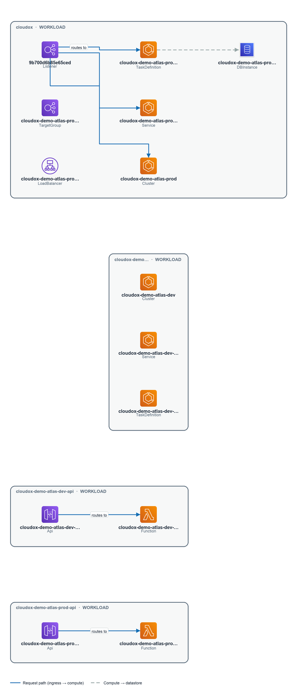

# Architect View — Workloads & Systems

> **Demo Report** — AWS account IDs and resource identifiers in this report have been
> replaced with synthetic equivalents for public safety. Architecture, workloads,
> findings, and relationships are based on a real AWS environment.

---

> _Part of the [Architect View](./README.md) · Audience: Solutions / Cloud Architects · Confidence: Likely_

## Workloads & Systems

The estate resolves to **3 systems** and **12 significant workloads** (3 further workloads were demoted as helper/governance artefacts), spread across 7 accounts and 807 resources — the majority in **eu-central-1**. Classification confidence is mixed: a large proportion of resources carry no Environment/Stage/Tier tags, so workload boundaries are inferred rather than declared. Architects should treat workload membership as a working model to validate, not a ground truth.

### Systems

One system is explicitly identified from the evidence:

| System | Confidence | Notes |
|---|---|---|
| **Cloudox Demo Atlas Dev** | Assumed | No account or region binding confirmed; inferred from workload grouping |

Two further systems are implied by the prod/dev split of the Atlas workloads and the presence of a sandbox account, but the package does not surface them as named system entities. No evidence found for additional named systems beyond the above.

> **Confidence note (Assumed):** The Cloudox Demo Atlas Dev system boundary is inferred. Its account and region attribution are not confirmed in the available evidence.

### Workloads

Six workloads are identified across three accounts, all anchored in **eu-central-1**:

| Workload | Account | Region | Confidence | Key Evidence |
|---|---|---|---|---|
| **Cloudox** | 122122642149 | eu-central-1 | Verified | — |
| **Cloudox Demo Atlas Prod API** | 122122642149 | eu-central-1 | Likely | API GW endpoint `xdmn5ldmif.execute-api.eu-central-1.amazonaws.com`; DynamoDB table `cloudox-demo-atlas-prod-items` |
| **Cloudox Demo Atlas Dev** | 105769365151 | eu-central-1 | Likely | DynamoDB table `cloudox-demo-atlas-dev-items` |
| **Cloudox Demo Atlas Dev API** | 105769365151 | eu-central-1 | Likely | API GW endpoint `gfwaiva01f.execute-api.eu-central-1.amazonaws.com` |
| **Cloudox Demo Sandbox Scratch** | 161388682021 | eu-central-1 | Assumed | DynamoDB table `cloudox-demo-sandbox-scratch` |

The **Cloudox** workload (account 122122642149) is the only Verified entity — it shares an account with the Atlas Prod API, suggesting a potential co-tenancy or platform dependency worth confirming. The sandbox workload (`cloudox-demo-sandbox-scratch`) is Assumed confidence; its scope and lifecycle are not established from the available evidence.

Internet gateways are present across multiple accounts and regions (eu-central-1 and us-east-1), indicating that at least some workloads have or had internet-facing paths:

| IGW | Account | Region |
|---|---|---|
| `igw-0d14f1dd4e54d5906` | 110019496666 | eu-central-1 |
| `igw-00ed21b9a0e6596a8` | 110019496666 | us-east-1 |
| `igw-0567575921f471548` | 105769365151 | us-east-1 |
| `igw-0cff0d66b4fd90803` | 122980216815 | us-east-1 |

The us-east-1 IGWs appear in accounts not associated with the named workloads above. No evidence found for active workloads in us-east-1 — these may represent dormant VPC infrastructure or accounts outside the current workload inventory.

### Components & Tiers

From the evidence, two component tiers are visible for the Atlas workloads:

- **API tier:** Amazon API Gateway public endpoints serve as the front door for both the dev API (`gfwaiva01f.execute-api.eu-central-1.amazonaws.com`) and the prod API (`xdmn5ldmif.execute-api.eu-central-1.amazonaws.com`). Both are internet-reachable (`internet` ingress path confirmed).
- **Data tier:** Amazon DynamoDB tables back each environment — `cloudox-demo-atlas-dev-items` (account 105769365151), `cloudox-demo-atlas-prod-items` (account 122122642149), and `cloudox-demo-sandbox-scratch` (account 161388682021).

No evidence found for compute tiers (e.g., Lambda, ECS, EC2) within this section's package — the integration layer between API Gateway and DynamoDB is not confirmed here and should be treated as an unknown.

**Design observations for architects:**
- Dev and prod workloads are isolated into separate AWS accounts, which is a sound boundary pattern, but the co-location of **Cloudox** and **Cloudox Demo Atlas Prod API** in the same account (122122642149) warrants a blast-radius review.
- 761 of 807 resources lack Environment/Stage/Tier tags, making automated governance, cost allocation, and workload-boundary enforcement unreliable at scale. Tag remediation is a prerequisite for confident architecture analysis.
- The us-east-1 IGWs in accounts with no identified workloads represent unaccounted network exposure that should be investigated.

