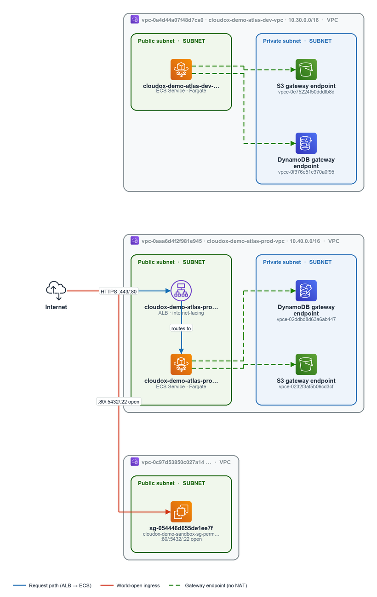

# Operations View

> **Demo Report** — This discovery report was produced from a real AWS environment by
> [CloudoX](https://cloudox.io). AWS account IDs and all resource identifiers (VPC,
> subnet, security group, IAM role IDs, KMS key IDs, and similar) have been replaced
> with deterministic synthetic equivalents so the report can be shared publicly.
> Architecture patterns, workload structure, findings, and service configurations are
> otherwise unmodified — this is not dummy data.

---

> **Audience:** Platform / Operations Engineers  
> **Overall confidence:** Verified  
> Operational documentation: inventory, connectivity, routing, observability, backup/recovery indicators, and operational risks.

**This view answers**

- What can break?
- What requires operational attention?
- What recovery risks exist?

**Sections**

- [Operational Overview](#operational-overview)
- [Critical Components](#critical-components)
- [Connectivity & Routing](#connectivity-routing)
- [Failure Points](#failure-points)
- [Monitoring & Logging Gaps](#monitoring-logging-gaps)
- [Backup & Recovery Signals](#backup-recovery-signals)
- [Operational Risks](#operational-risks)
- [Runbook / Validation Questions](#runbook-validation-questions)
- [Infrastructure Reference Appendix](#infrastructure-reference-appendix)

---

## Operational Overview

The environment spans **807 resources across 7 accounts**, with 12 significant workloads active across Development, Production, and Sandbox environments. Three additional workloads have been classified as helper/governance and are not primary operational concerns. This breadth, combined with known observability gaps, means the operational blast radius of any account-level incident is wider than what typed collectors alone can confirm.

### What's Running

The following accounts and environments make up the operational footprint:

| Account | Friendly Name | Environment(s) | Confidence |
|---|---|---|---|
| 110319895932 | Management Account | — | Verified |
| 105769365151 | Workload Dev Account | Development Environment | Verified |
| 122122642149 | Workload Prod Account | Production Environment (122122642149) | Verified |
| 161388682021 | Sandbox Ma Account | Sandbox Environment | Verified |
| 122980216815 | Log Archive Account | 122980216815 Unknown | Likely / Assumed |
| 110019496666 | Audit Account | — | Likely |
| 150982215529 | Platform Account | Production Environment (150982215529) | Likely |

Workload-bearing environments confirmed by evidence:

- **Development Environment** (Workload Dev Account `105769365151`): Hosts the `cloudox-demo-atlas-dev-items` DynamoDB table (`arn:aws:dynamodb:eu-central-1:105769365151:table/cloudox-demo-atlas-dev-items`) and an API Gateway endpoint at `https://xdmn5ldmif.execute-api.eu-central-1.amazonaws.com`, both in `eu-central-1`. An internet gateway (`igw-0567575921f471548`) is present in `us-east-1` for this account.
- **Production Environment** (Workload Prod Account `122122642149`): Hosts the `cloudox-demo-atlas-prod-items` DynamoDB table (`arn:aws:dynamodb:eu-central-1:122122642149:table/cloudox-demo-atlas-prod-items`) in `eu-central-1`. An internet gateway (`igw-0cff0d66b4fd90803`) is present in `us-east-1`.
- **Sandbox Environment** (Sandbox Ma Account `161388682021`): Hosts the `cloudox-demo-sandbox-scratch` DynamoDB table (`arn:aws:dynamodb:eu-central-1:161388682021:table/cloudox-demo-sandbox-scratch`) in `eu-central-1`.
- **Audit Account** (`110019496666`): Internet gateways present in both `eu-central-1` (`igw-0d14f1dd4e54d5906`) and `us-east-1` (`igw-00ed21b9a0e6596a8`), indicating active networking in two regions.

Two API Gateway endpoints are internet-facing (`https://gfwaiva01f.execute-api.eu-central-1.amazonaws.com`, `https://xdmn5ldmif.execute-api.eu-central-1.amazonaws.com`), both in `eu-central-1`. These represent externally reachable ingress points that require monitoring and access control attention.

### Operational Footprint

**Coverage gaps — act on these:**

- **761 of 807 resources carry no Environment / Stage / Tier tag.** Classification for these resources relies entirely on inference. Any automation, alerting, or cost allocation that depends on tags will have significant blind spots. Tag remediation is a prerequisite for reliable operational segmentation.
- **Resource Explorer meta-collector was disabled or unavailable.** The full AWS-visible resource breadth could not be cross-checked. There may be resource types or regions not captured by typed collectors that are operationally active but invisible to this view.
- **Cloud Control meta-collector was disabled.** Long-tail and newer resource types are limited to what typed collectors explicitly cover. Untracked resources cannot be assessed for backup, observability, or recovery posture.

**Multi-region exposure:** Internet gateways are confirmed in both `eu-central-1` and `us-east-1` across multiple accounts (Workload Dev, Workload Prod, Audit). This means operational runbooks, incident response, and monitoring must account for at least two AWS regions. The presence of `us-east-1` internet gateways alongside `eu-central-1` workload resources warrants verification that these gateways are intentional and not residual.

**Account confidence note:** The Log Archive Account (`122980216815`) environment classification is Assumed; the Audit Account (`110019496666`) and Platform Account (`150982215529`) are Likely. Operational procedures that depend on these accounts should be validated against authoritative account inventory before relying on this classification.

---

## Critical Components

The most operationally significant finding in this section is a single-AZ database instance sitting directly in the critical path of a production workload — a zone failure would take the entire data tier offline with no automatic failover.

### Critical Workloads

The following workloads are identified as key entities in this environment:

| Friendly Name | Account | Region | Confidence |
|---|---|---|---|
| Cloudox Demo Atlas Prod API (`cloudox-demo-atlas-prod-api`) | 122122642149 | eu-central-1 | Likely |
| Cloudox (`cloudox`) | 122122642149 | eu-central-1 | Verified |
| Cloudox Demo Atlas Dev API (`cloudox-demo-atlas-dev-api`) | 105769365151 | eu-central-1 | Likely |
| Cloudox Demo Atlas Dev (`cloudox-demo-atlas-dev`) | 105769365151 | eu-central-1 | Likely |
| Cloudox Demo Sandbox Scratch (`cloudox-demo-sandbox-scratch`) | 161388682021 | eu-central-1 | Assumed |

> **Coverage gap:** 761 resources carry no Environment / Stage / Tier tag; their classification relies on inference. Workload boundaries and criticality assignments for untagged resources should be treated as approximate until tagging is enforced.

Internet-facing API Gateway endpoints are present across multiple accounts and regions, indicating externally reachable surfaces for at least some of these workloads:
- `https://gfwaiva01f.execute-api.eu-central-1.amazonaws.com`
- `https://xdmn5ldmif.execute-api.eu-central-1.amazonaws.com`

Internet gateways are also present in both `eu-central-1` and `us-east-1` across accounts `110019496666`, `105769365151`, and `122980216815` (`igw-0d14f1dd4e54d5906`, `igw-00ed21b9a0e6596a8`, `igw-0567575921f471548`, `igw-0cff0d66b4fd90803`), confirming outbound/inbound internet paths exist in the environment.

### Shared Dependencies

**⚠ Single-AZ Datastore in Production Critical Path**

Intelligence item `dependency_concern:architecture:cloudox-demo-atlas-prod-pg` (priority 3, significance 0.57) identifies a verified architectural risk:

- **Affected datastore:** `cloudox-demo-atlas-prod-pg` (DBInstance)
- **Affected workload:** Cloudox Demo Atlas Prod API (`cloudox-demo-atlas-prod-api`, account 122122642149, eu-central-1)
- **Impact:** The datastore is not Multi-AZ. A single Availability Zone failure will take the production data tier offline for the dependent workload. There is no evidence of automatic failover.
- **What can break:** Any operation served by Cloudox Demo Atlas Prod API that requires database reads or writes will fail for the duration of a zone outage.
- **Recovery risk:** Recovery depends on manual intervention or a restore-from-backup process. RTO is unknown — no backup or recovery configuration evidence is present in this package.
- **Recommended action:** Confirm whether Multi-AZ is enabled or can be enabled on `cloudox-demo-atlas-prod-pg`. Verify that automated backups are configured and that the dependent workload has a tested failover or degraded-mode path for data-tier unavailability.

DynamoDB tables are present across the dev, prod, and sandbox workloads:
- `arn:aws:dynamodb:eu-central-1:105769365151:table/cloudox-demo-atlas-dev-items` (dev)
- `arn:aws:dynamodb:eu-central-1:122122642149:table/cloudox-demo-atlas-prod-items` (prod)
- `arn:aws:dynamodb:eu-central-1:161388682021:table/cloudox-demo-sandbox-scratch` (sandbox)

No evidence is available in this package regarding backup configuration, point-in-time recovery status, or replication settings for these tables. This is a coverage gap that warrants direct verification.

> **Observability gap:** No evidence of monitoring, alerting, or on-call runbooks for `cloudox-demo-atlas-prod-pg` or the DynamoDB tables is present in this package. Failure detection and escalation paths are unknown.

---

## Connectivity & Routing

The environment spans **15 VPCs** and **63 subnets** across accounts, with **25 internet-facing access paths** observed and a single load balancer in scope. All key entities are in `eu-central-1`. Three named VPCs anchor the topology: **Cloudox Demo Atlas Dev VPC** (`vpc-0a4d44a07f48d7ca0`, account `105769365151`), **Cloudox Demo Atlas Prod VPC** (`vpc-0aaa6d4f2f981e945`, account `122122642149`), and **Cloudox Demo Sandbox VPC** (`vpc-0c97d53850c027a14`, account `161388682021`).

### Network Connectivity

Five subnets are explicitly identified as public-facing across the three primary accounts:

| Friendly Name | Subnet ID | Account | Region |
|---|---|---|---|
| Public Subnet (eu-central-1) | `subnet-016c22941a019a137` | 122122642149 (Prod) | eu-central-1 |
| Public Subnet (eu-central-1) | `subnet-013a24d318ed6f3d0` | 122122642149 (Prod) | eu-central-1 |
| Public Subnet (eu-central-1) | `subnet-0f64d71c952a7898a` | 105769365151 (Dev) | eu-central-1 |
| Public Subnet (eu-central-1) | `subnet-065f522206524ab12` | 105769365151 (Dev) | eu-central-1 |
| Public Subnet (eu-central-1) | `subnet-029e2cceb3d0beff7` | 161388682021 (Sandbox) | eu-central-1 |

All five are in the same region. The presence of public subnets in **all three environments** — including Sandbox — means internet exposure is not limited to production. The 25 internet-facing access paths observed across the environment warrant review to confirm each is intentional.

A **DynamoDB Interface Endpoint** (`vpce-02ddbd8d63a6ab447`) is present in the Prod account (`122122642149`), routing DynamoDB traffic privately within the VPC. No equivalent endpoint is evidenced for the Dev or Sandbox VPCs — traffic to DynamoDB from those environments may traverse the public internet. No other VPC endpoints are evidenced in this package.

Two AWS-managed prefix lists are referenced in the environment:
- `pl-66a5400f` (`arn:aws:ec2:eu-central-1:aws:prefix-list/pl-66a5400f`)
- `pl-6ea54007` (`arn:aws:ec2:eu-central-1:aws:prefix-list/pl-6ea54007`)

These are AWS-managed prefix lists for `eu-central-1` (commonly used for S3 and DynamoDB gateway routing). Their presence in security group or route table rules is the likely context, but specific rule associations are not evidenced in this package.

### Routing & Gateways

Each of the three primary VPCs has a dedicated Internet Gateway:

| Gateway | ID | VPC / Account |
|---|---|---|
| Cloudox Demo Atlas Dev Igw | `igw-0155958a0a5e9c500` | Dev VPC / 105769365151 |
| Cloudox Demo Atlas Prod Igw | `igw-01dd5625ec1ea7a54` | Prod VPC / 122122642149 |
| Sandbox Internet Gateway | `igw-08017528fa36ccb4d` | Sandbox VPC / 161388682021 |

All three VPCs have direct internet egress capability via their respective IGWs. No NAT Gateways, Transit Gateways, or VPC peering connections are evidenced in this package. The absence of evidence for inter-VPC routing means lateral connectivity between Dev, Prod, and Sandbox is not confirmed — treat as unknown.

One load balancer is present in the environment. Its type, placement (public vs. internal), and target configuration are not detailed in this package.

### Egress Paths

With IGWs attached to all three VPCs and public subnets in each, all three environments have direct outbound internet paths. The **25 internet-facing access paths** observed across the environment represent a meaningful operational surface:

- **Operational risk:** Any misconfigured security group or route table on a public subnet in any account can expose workloads directly. This is equally true for Dev and Sandbox as for Prod.
- **No evidence of centralised egress control** (e.g., a shared egress VPC, firewall appliance, or AWS Network Firewall) is present in this package. Egress filtering posture is unknown.
- The DynamoDB Interface Endpoint in Prod (`vpce-02ddbd8d63a6ab447`) provides a private egress path for DynamoDB traffic in that account. No equivalent private egress for S3 or other services is evidenced.

The AWS-managed prefix lists (`pl-66a5400f`, `pl-6ea54007`) may be used to scope gateway-route or security-group rules for AWS service traffic, but their exact usage context is not confirmed in this package.

---

## Failure Points

With a single load balancer serving 25 internet-facing access paths across 15 VPCs and 63 subnets, the architecture carries concentrated failure risk at the ingress layer — that one load balancer is the most operationally significant component to watch.

### Single Points of Failure

The most immediately actionable concern is the **single load balancer** observed across the entire environment. With 25 internet-facing access paths routed through it, any failure, misconfiguration, or capacity event at that load balancer has broad blast radius — potentially taking down all externally reachable services simultaneously.

Two AWS-managed prefix lists are referenced in the network configuration:

| Prefix List | ARN |
|---|---|
| pl-66a5400f | `arn:aws:ec2:eu-central-1:aws:prefix-list/pl-66a5400f` |
| pl-6ea54007 | `arn:aws:ec2:eu-central-1:aws:prefix-list/pl-6ea54007` |

These are AWS-managed (not customer-managed), so their content is controlled by AWS and cannot be directly audited or locked. Security group or route table rules that depend on these prefix lists will silently change behaviour if AWS updates the underlying CIDR ranges — a subtle but real operational risk.

### Resilience Gaps

**Tagging coverage is a material operational gap.** 761 of 807 resources (approximately 94%) carry no Environment, Stage, or Tier tag, meaning their classification relies on inference rather than explicit metadata. This directly affects:

- **Incident scoping**: During an outage, operators cannot quickly filter resources by environment (e.g., production vs. non-production) using tags alone.
- **Blast radius assessment**: Without tier tags, it is not possible to reliably determine which resources are customer-facing vs. internal at query time.
- **Automation and runbook targeting**: Any tag-driven automation (auto-remediation, backup policies, scaling rules) will have unreliable coverage across the 807-resource estate.

The 15 VPCs and 63 subnets spread across 7 accounts suggest a multi-account topology, but no evidence is available in this package about cross-VPC connectivity redundancy, Transit Gateway presence, or subnet distribution across Availability Zones. Those are coverage gaps that should be investigated separately to complete the resilience picture.

---

## Monitoring & Logging Gaps

Three collector-level blind spots limit what this Operations view can assert with confidence: Security Hub enablement is unconfirmed, two meta-collectors were disabled during discovery, and no CloudWatch utilisation data was ingested. Each gap directly affects what can break without warning and what recovery risks remain invisible.

### Logging Coverage

One organisation-level CloudTrail trail is present (`cloudox-demo-org-trail-o-aaaapzvebq`, `arn:aws:cloudtrail:eu-central-1:110319895932:trail/cloudox-demo-org-trail-o-aaaapzvebq`), with a dedicated log-delivery role (`arn:aws:iam::110319895932:role/cloudox-demo-org-trail-logs`). This is the only logging signal confirmed in the discovery data.

**Security Hub** — No Security Hub enablement was discovered across any account in scope (`evidence_gap:security:no-security-hub-enablement-discovered`). Without Security Hub, there is no centralised aggregation of GuardDuty, Config, Inspector, or IAM Access Analyzer findings. Operational teams have no single pane for security-event triage, and automated remediation workflows that depend on Security Hub findings cannot be assumed to exist.

**Discovery breadth caveat** — Two meta-collectors that would cross-check the completeness of the above picture were not active:
- The **Resource Explorer** meta-collector was disabled or unavailable, so the full AWS-visible resource breadth could not be independently verified (`evidence_gap:coverage:resource-explorer-meta-collector-was-disabled-or-unavailable-aws-visible-breadth-could-not-be-cross-checked`).
- The **Cloud Control** meta-collector was disabled, meaning long-tail resource types (those not covered by typed collectors) may be absent from the inventory (`evidence_gap:coverage:cloud-control-meta-collector-was-disabled-long-tail-resource-types-are-limited-to-typed-collector-coverage`).

The headline figure of 807 resources captured should be read as a lower-bound estimate, not a complete inventory. Resources outside typed-collector coverage are not represented.

### Monitoring Gaps

**CloudWatch utilisation metrics** — CloudoX did not collect CloudWatch metrics in this run (`evidence_gap:cost:cloudox-does-not-collect-cloudwatch-utilization-metrics-in-this-version-idle-underutilized-or-right-sizing-recommendations-based-on-actual-usage-are-not-available`). This means:
- No CPU, memory, network, or storage utilisation baselines are available.
- Idle or underutilised resources cannot be identified from this data.
- Alarm coverage (whether alarms exist and are in OK/ALARM state) is unknown.

**Cost Explorer** — Cost Explorer collection was disabled (`CLOUDOX_COST__ENABLED=false` / `--no-collect-costs`) (`evidence_gap:cost:cost-explorer-collection-is-disabled-cloudox-cost-enabled-false-no-collect-costs-spend-figures-are-unavailable-the-analysis-below-is-derived-from-the-discovered-architecture-only`). Spend figures are unavailable; any cost-related observations in this view are derived from architecture shape alone, not actual billing data.

**Collector coverage gaps for specific services** — RDS read replicas, RDS provisioned IOPS, DynamoDB capacity mode, Direct Connect, and S3 storage classes are not captured by the current collectors (`evidence_gap:cost:rds-read-replicas-rds-provisioned-iops-dynamodb-capacity-mode-direct-connect-and-s3-storage-classes-are-not-captured-by-the-current-collectors-so-cost-drivers-for-them-are-not-detected`). Operational attributes tied to these dimensions (e.g., replica lag, IOPS saturation, DynamoDB throttling mode) are therefore not visible in this view.

| Gap | Operational Risk | Recommended Action |
|---|---|---|
| Security Hub not discovered | No centralised finding aggregation; security events may go undetected | Verify enablement; enable if absent |
| Resource Explorer disabled | Inventory may be incomplete; unknown resources could be unmonitored | Re-run discovery with Resource Explorer enabled |
| Cloud Control disabled | Long-tail resource types absent from inventory | Re-run discovery with Cloud Control enabled |
| CloudWatch metrics not collected | No utilisation baselines; alarm state unknown | Enable CloudWatch collection in next CloudoX run |
| Cost Explorer disabled | Spend anomalies and budget overruns not detectable from this data | Enable cost collection (`CLOUDOX_COST__ENABLED=true`) |
| RDS/DynamoDB/S3/Direct Connect collector gaps | Capacity and performance attributes for these services are blind spots | Await typed-collector updates or use Cloud Control |

> **Confidence note:** All items in this section are rated *Unknown* — they represent the absence of evidence rather than confirmed findings. Operational decisions that depend on these signals should not be made until the gaps are resolved.

---

## Backup & Recovery Signals

The most operationally significant finding here is a single-AZ database instance that represents a concrete availability and recovery risk. Of 807 resources captured, no broad coverage gaps were flagged — but two meta-collector limitations mean the full AWS resource breadth could not be independently cross-checked (see Unknowns below).

### Backup Signals

No backup-specific signals (e.g., snapshot schedules, retention policies, or backup job status) are present in the available evidence for this section. Coverage of backup configuration details is limited by the collector gaps noted below.

### Recovery Readiness

One recovery-readiness issue was identified:

| Resource | Issue | Impact | Recommended Action |
|---|---|---|---|
| `cloudox-demo-atlas-prod-pg` | Not Multi-AZ | Reduced availability / recovery posture | Evaluate enabling Multi-AZ for resilience |

**`cloudox-demo-atlas-prod-pg`** (`modernization_opportunity:architecture:cloudox-demo-atlas-prod-pg`) is a DBInstance running in a single Availability Zone. A zone-level failure could cause unplanned downtime or data loss with no automatic failover. This is classified as a modernization opportunity (priority 4) rather than an immediate incident, but it is a meaningful gap in recovery posture for a production database.

**What can break:** A failure of the AZ hosting `cloudox-demo-atlas-prod-pg` would take the instance offline. Without Multi-AZ, there is no standby replica to promote automatically.

**What requires operational attention:** Evaluate whether the workload's RTO/RPO tolerances are compatible with single-AZ operation. If not, enabling Multi-AZ (or an equivalent HA mechanism) should be scheduled.

**Recovery risk:** Manual recovery from a snapshot or backup would be required following a zone failure, extending downtime beyond what Multi-AZ standby promotion would provide.

> **Coverage note:** Resource Explorer and Cloud Control meta-collectors were unavailable during discovery. Long-tail resource types and full AWS-visible inventory breadth could not be cross-checked. Additional resources with backup or recovery gaps may exist but are not visible in this dataset.

---

## Operational Risks

Two detection-coverage gaps affect five of six scanned accounts simultaneously, leaving the majority of the estate with reduced visibility into both external access exposure and active threats. A third risk — a broadly-named admin IAM role in the Sandbox — carries lower confidence but warrants validation before it is dismissed.

> **Coverage note:** Resource Explorer and Cloud Control meta-collectors were unavailable during this scan. Long-tail resource types and AWS-visible breadth could not be cross-checked; additional risks may exist beyond typed collector coverage.

### Highest Operational Risks

#### 1. Uneven GuardDuty Threat Detection Coverage — 5 accounts uncovered
`risk:security:aws-guardduty-detector` · Severity: **Medium** · Priority 2

GuardDuty is enabled in only 1 of 6 scanned accounts. The following accounts have **no active threat detection**:

| Account | ID |
|---|---|
| Log Archive Account | 122980216815 |
| Workload Dev Account | 105769365151 |
| Workload Prod Account | 122122642149 |
| Management Account | 110319895932 |
| Sandbox Ma Account | 161388682021 |

**Operational impact:** Malicious activity — credential abuse, crypto-mining, C2 communication, lateral movement — occurring in these accounts will not generate GuardDuty findings. Incidents may go undetected until they surface through other means (billing anomalies, customer reports, etc.).

**What can break / recovery risk:** Without findings, automated or manual incident-response runbooks that depend on GuardDuty alerts will not trigger. The Workload Prod Account (`122122642149`) and Management Account (`110319895932`) are the highest-consequence gaps.

**Recommended action:** Enable GuardDuty across all accounts, preferably org-wide via a delegated administrator in the Management Account to ensure consistent, centrally-managed coverage.

---

#### 2. Uneven IAM Access Analyzer Coverage — 5 accounts uncovered
`risk:security:aws-accessanalyzer-analyzer` · Severity: **Medium** · Priority 2

IAM Access Analyzer is enabled in only 1 of 6 scanned accounts. The same five accounts listed above are uncovered.

**Operational impact:** Unintended external access to S3 buckets, IAM roles, KMS keys, SQS queues, and other resource-based policies in these accounts will not be surfaced automatically. Misconfigurations that expose resources to the internet or to external AWS principals will remain silent.

**What can break / recovery risk:** The Log Archive Account (`122980216815`) is particularly sensitive — undetected external access to log data could undermine audit integrity and compliance posture. The Management Account (`110319895932`) exposure is similarly high-consequence.

**Recommended action:** Enable IAM Access Analyzer org-wide via a delegated administrator. This provides a single pane of findings and avoids per-account enablement drift.

---

#### 3. Broadly-Privileged IAM Role: `cloudox-demo-sandbox-unused-admin`
`risk:security:cloudox-demo-sandbox-unused-admin` · Severity: **Medium** · Priority 3 · Confidence: **Assumed**

The IAM role `cloudox-demo-sandbox-unused-admin` (ID: `AROAAAAADPCL3BVEXUDTH`) exists in the **Sandbox Ma Account** (`161388682021`). Its name suggests broad or administrative access, but attached policy details were not collected — the privilege breadth is inferred from naming only and must be validated directly.

**Operational impact (if confirmed):** An over-privileged, potentially unused role represents a large identity blast radius. If the role's trust policy allows broad assumption, it could be exploited to escalate privileges or move laterally within the sandbox.

**What requires operational attention:** Confirm whether the role is actively used, review all attached managed and inline policies, and apply least-privilege scoping. If the role is genuinely unused, consider deleting it.

**Recommended action:** Review attached policies; apply least privilege. Validate before treating this as a confirmed risk — the current assessment is based on naming convention alone.

---

## Runbook / Validation Questions

One open validation question requires owner confirmation before it can be closed. The item below is flagged **Assumed** confidence — meaning the concern is inferred from observed configuration rather than confirmed policy — so a human decision is needed to resolve it.

### Operational Checks

The following environmental context is relevant when working through the validation items:

- **Network footprint:** 15 VPCs, 63 subnets, 1 load balancer, and 25 internet-facing access paths are present in scope. Any role with administrative privileges operating in this environment has a correspondingly broad blast radius.
- **Coverage gaps to be aware of:** Two material observability gaps affect the completeness of this runbook:
  - Resource Explorer meta-collector was disabled or unavailable; AWS-visible resource breadth could not be cross-checked against typed collector findings.
  - Cloud Control meta-collector was disabled; long-tail resource types are limited to typed collector coverage only.
  
  These gaps mean additional roles or resources with elevated privileges may exist but are not visible in the current dataset. Treat the validation question below as a minimum, not an exhaustive list.

- **AWS-managed prefix lists in scope** (`pl-66a5400f`, `pl-6ea54007`) are referenced in the network graph. Confirm that security group or route table rules consuming these prefix lists are intentional and reviewed as part of any privilege audit.

### Questions to Validate

The single open item requiring owner response is:

| # | Item ID | Affected Resource | Question |
|---|---------|-------------------|----------|
| 1 | `validation_question:security:cloudox-demo-sandbox-unused-admin` | `cloudox-demo-sandbox-unused-admin` (IAM Role, account `161388682021`) | Does IAM role `cloudox-demo-sandbox-unused-admin` require its current privilege level, and who owns it? |

**Detail — Confirm the scope of IAM role `cloudox-demo-sandbox-unused-admin`**

- **Entity:** IAM role `cloudox-demo-sandbox-unused-admin` (role ID `AROAAAAADPCL3BVEXUDTH`, account `161388682021`)
- **Concern:** The role name contains `unused-admin`, which raises the question of whether administrative privileges are intentional and actively required, or whether this is a dormant role that has not been cleaned up.
- **Confidence:** Assumed — the concern is inferred from observed configuration; no confirmed policy or usage data was available to resolve it automatically.
- **Action required:** Identify the team or individual who owns this role. Confirm whether the current privilege level is necessary. If the role is genuinely unused, assess whether it should be scoped down or removed to reduce standing privilege exposure.
- **No automated recommended action is set** — this requires a human judgement call from the role owner.

> **Note for operators:** Because Resource Explorer and Cloud Control collectors were both unavailable during discovery, it is not possible to confirm whether this is the only over-privileged or unused role in the account. A manual or CLI-assisted review of IAM roles in account `161388682021` is advisable to supplement this finding.

---

## Infrastructure Reference Appendix

This appendix provides a stable friendly-name → raw-identifier mapping for the entities observed in this environment. Use it to correlate alerts, logs, and IaC references against cloud-provider identifiers. No intelligence items were available to populate a deeper inventory narrative for this section — the tables below represent the complete closed-world evidence.

### Infrastructure Inventory

No evidence found for a structured service or resource inventory beyond the key entities listed below. Coverage gaps (observability instrumentation, backup configuration, runtime state) cannot be assessed from the available package.

### Entity Reference

#### Accounts

| Friendly Name | Account ID | Confidence |
|---|---|---|
| Management Account | `110319895932` | Verified |
| Sandbox Ma Account | `161388682021` | Verified |
| Workload Dev Account | `105769365151` | Verified |
| Workload Prod Account | `122122642149` | Verified |
| Log Archive Account | `122980216815` | Likely |

> **Note — Log Archive Account (`122980216815`):** Confidence is *Likely*, not Verified. Treat references to this account in runbooks with caution until ownership and purpose are confirmed.

#### Subnets (eu-central-1)

| Friendly Name | Subnet ID | Account | Confidence |
|---|---|---|---|
| Public Subnet (eu-central-1) | `subnet-016c22941a019a137` | Workload Prod (`122122642149`) | Verified |
| Public Subnet (eu-central-1) | `subnet-0f64d71c952a7898a` | Workload Dev (`105769365151`) | Verified |
| Public Subnet (eu-central-1) | `subnet-065f522206524ab12` | Workload Dev (`105769365151`) | Verified |
| Public Subnet (eu-central-1) | `subnet-013a24d318ed6f3d0` | Workload Prod (`122122642149`) | Verified |
| Public Subnet (eu-central-1) | `subnet-029e2cceb3d0beff7` | Sandbox Ma (`161388682021`) | Verified |

All observed subnets are in **eu-central-1**. No evidence found for subnets in other regions. Multiple subnets share the friendly name "Public Subnet (eu-central-1)" — use the raw subnet ID for unambiguous identification in runbooks and automation.

#### Security Groups

| Friendly Name | Security Group ID | Account | Confidence |
|---|---|---|---|
| Cloudox Demo Sandbox Sg Permissive | `sg-054446d655de1ee7f` | Sandbox Ma (`161388682021`) | Verified |
| Cloudox Demo Atlas Prod Sg ALB | `sg-06f2b4190bf01d261` | Workload Prod (`122122642149`) | Verified |

**Operational callout — `sg-054446d655de1ee7f` (Cloudox Demo Sandbox Sg Permissive):** The name explicitly signals permissive rules. Confirm this group is scoped strictly to the Sandbox Ma account and is not referenced by Workload Prod or Workload Dev resources. No rule-level detail is available in this package to verify blast radius.
